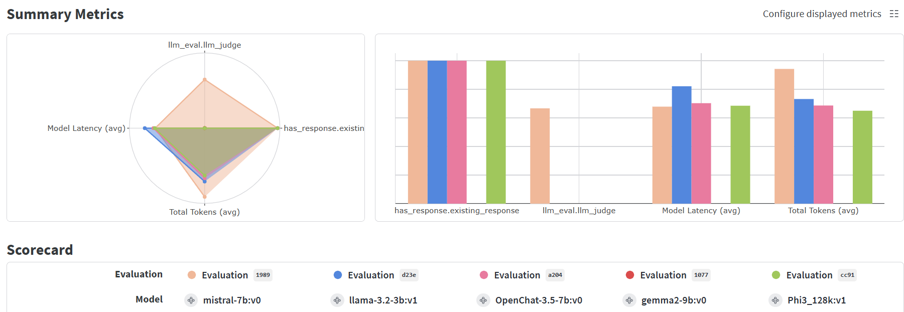

# llm_eval_ops

<a target="_blank" href="https://cookiecutter-data-science.drivendata.org/">
    
</a>

Using Weave framework to evaluate and assess the performance of Large Language Models.

## Project Organization

```
|── LICENSE            <- Open-source license if one is chosen
|── README.md          <- The README file that describes the project.
|
|── docs               <- Documentation files or directories.
|
|── models             <- Pre-trained models, serialized outputs, or model predictions.
|
|── notebooks          <- Jupyter notebooks for exploratory or interactive work.
|
|── references         <- Manuals, guides, and other explanatory materials.
|
|── reports            <- Generated outputs such as analysis, reports, and plots.
|   └── figures        <- Visual outputs like charts and figures used in reporting.
|
|── requirements.txt   <- Dependency list to replicate the project environment.
|
|── llm_eval_ops       <- Main source code for the project.
|    │
|    ├── __init__.py    <- Makes `llm_eval_ops` a Python module.
|    │
|    ├── config.py      <- Centralized configuration for the entire project.
|    │
|    ├── data
|    │   ├── make_dataset.py <- Script to create datasets from raw inputs.
|    │   └── __pycache__    <- Compiled Python files for the `data` module.
|    │
|    ├── evaluation      <- Evaluation scripts and utilities.
|    │   ├── eval.py     <- Evaluation scripts for assessing model performance.
|    │   ├── __init__.py <- Makes `evaluation` a Python module.
|    │   └── __pycache__ <- Compiled Python files for the `evaluation` module.
|    │
|    ├── model           <- Model-related scripts and utilities.
|    │   ├── llm.py      <- Scripts to load, fine-tune, or manage LLMs.
|    │   ├── __init__.py <- Makes `model` a Python module.
|    │   └── __pycache__ <- Compiled Python files for the `model` module.
|    │
|    ├── run             <- Scripts for orchestrating pipeline execution.
|    │   ├── run_pipe.py <- Script to orchestrate the end-to-end pipeline.
|    │   ├── __init__.py <- Makes `run` a Python module.
|    │   └── __pycache__ <- Compiled Python files for the `run` module.
|    |
|    │──init__.py         <- Makes `llm_eval_ops` a Python module.
|    |──config.py   <- Pipeline-specific configuration settings.
│
└── setup.cfg          <- Configuration file for formatting and linting tools.
```

## Project Setup

To set up the project environment, follow these steps:

1. **Build Conda Environment:**
   First, create the Conda environment using the `environment.yml` file. This file contains all the necessary dependencies for the project.

   ```bash
   conda env create -f environment.yml
   ```

   Activate the Conda environment:

   ```bash
   conda activate python3.10
   ```

2. **Set Up Virtualenv:**
   After setting up the Conda environment, create a virtual environment using `virtualenv` to manage additional dependencies or for isolated development.

   ```bash
   python -m venv .venv-dev
   ```

   Activate the virtual environment:

   - On Windows:

     ```bash
     .venv-dev\Scripts\activate
     ```

   - On Unix or MacOS:

     ```bash
     source .venv-dev/bin/activate
     ```

3. **Install Dependencies:**
   Finally, install the project dependencies using `requirements-dev.txt`.

   ```bash
   pip install -r requirements/requirements-dev.txt
   ```

This setup ensures that you have a consistent and isolated environment for running the project.


## Weight & Biases and Weave Integration
This project uses Weight & Biases (W&B) and Weave for tracking and visualizing experiments, model performance, and metrics. W&B provides powerful tools to monitor and compare your model's results in real time.

You can find the official W&B repository here: [link](https://wandb.ai/matiaspedro97/llm_logical_eval)

You can also find Weave's tracking sectio here: [link](https://wandb.ai/matiaspedro97/llm_logical_eval/weave)


## Example Results
Below is a screenshot of the evaluation results, showcasing the LLMs evaluation when tracked by Weave and W&B. The LLMs were instructed to guess the outcome of complex charades (in Portuguese).

Check the full example here: [link](https://wandb.ai/matiaspedro97/llm_logical_eval/weave/compare-evaluations?evaluationCallIds=%5B%220193a7e0-2799-7b00-97d0-cf9e67131989%22%2C%220193a7de-ece6-7753-b3fe-fecf9551cc91%22%2C%220193a7de-7266-79f2-b816-d990fe571077%22%2C%220193a7dd-4933-7130-81fe-3918235ca204%22%2C%220193a7db-cac7-71a1-85d9-1bac3cb0d23e%22%5D&metrics=%7B%22has_response.existing_response%22%3Atrue%2C%22correct_response.correct_response%22%3Atrue%2C%22llm_eval.llm_judge%22%3Atrue%2C%22Model+Latency+%28avg%29%22%3Atrue%2C%22Total+Tokens+%28avg%29%22%3Atrue%7D)





--------

